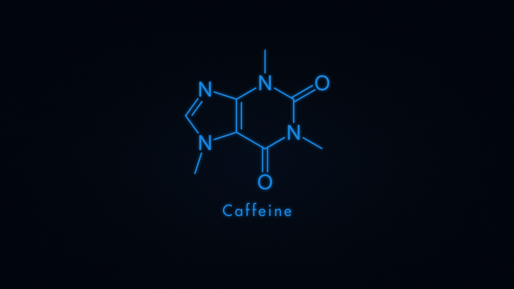

<style>
img[alt~="center"] {
  display: block;
  margin: 0 auto;
}
img[alt~="right"] {
  float: right;
}
img {
  background: transparent
}
section {
  background: #fff url(images/background.jpg) no-repeat center center;
  background-size: cover;
}
h1 {
      font-size: 60px;
}

</style>

<style scoped>
{
  text-align: center;
}
</style>


Automatisation des tests ANSIBLE

---

## Généralités

- Version 2 majeure en 2017
- Version 3 majeure en 2020
- Module écrit en python
- Appartient au projet Ansible
- Partage des normes ansible-galaxy

---

<style scoped>
{
  text-align: center;
}
</style>

# URL

<https://github.com/ansible/molecule>
<https://molecule.readthedocs.io>

---

<style scoped>
{
  text-align: center;
}
</style>

# Installation
*"why not do it with some style?"*

---

```bash
# Python 2
sudo apt install -y python
sudo apt install -y python-pip libssl-dev

# Ansible
sudo pip install 'ansible==2.9.5'

# Molecule
sudo pip install 'molecule==2.22'
molecule –version
```

---


## Pré-requis

### Driver Docker

- Runtime docker
- Module python : `docker`

### Driver VAGRANT

- Vagrant
- VirtualBox
- Module python : `python-vagrant`

---

<style scoped>
{
  text-align: center;
}
</style>

# Les bases

*"Wait ... what the hell is a gigawatt?!"*

---

<style scoped>
{
  text-align: center;
  font-size: 40px;
}
</style>

# Idempotence

Opération qui a le **même effet** qu'on l'applique une ou **plusieurs fois**.

---

## <!-- center --> Structure Ansible-galaxy

```ini
[README.md]
  Fichier principal de documentation
[defaults/]
  Variables avec valeurs par défaut (surchargeable)
[vars/]
  Variables qui représentent les paramètres d'appel
[files/]
  Fichiers libres
[handlers/]
  Handlers déclenchés en fin d'exécution par notification
[meta/]
  Informations meta pour le hub ansible-galaxy
[tasks/]
  Ensemble de tâches
[templates/]
  Templates JINJA
[tests/]
  Scripts de test *... on va y venir!!!*
```

---

<style scoped>
{
  text-align: center;
}
</style>

# Fonctionnement

*"You're not thinking fourth dimensionally!"*

---

<style scoped>
{
  font-size: 14px;
}
</style>

## Default lifecycle

|| test | check | lint | syntax | create | prepare | converge | idempotence | destroy |
|-:|:-:|:-:|:-:|:-:|:-:|:-:|:-:|:-:|:-:|
|lint|:white_check_mark:||:white_check_mark:|||||||
|dependency|:white_check_mark:|:white_check_mark:|:white_check_mark:||:white_check_mark:||:white_check_mark:|||
|cleanup|:white_check_mark:|:white_check_mark:||||||||
|destroy|:white_check_mark:|:white_check_mark:||||||||
|syntax|:white_check_mark:|||:white_check_mark:||||||
|create|:white_check_mark:|:white_check_mark:|||:white_check_mark:|:white_check_mark:||||
|prepare|:white_check_mark:|:white_check_mark:|||:white_check_mark:|:white_check_mark:|:white_check_mark:|||
|converge|:white_check_mark:|:white_check_mark:|||||:white_check_mark:|||
|check||:white_check_mark:||||||||
|idempotence|:white_check_mark:|||||||:white_check_mark:||
|side_effect|:white_check_mark:|||||||||
|verify|:white_check_mark:|||||||||
|cleanup|:white_check_mark:|:white_check_mark:|||||||:white_check_mark:|
|destroy|:white_check_mark:|:white_check_mark:|||||||:white_check_mark:|

---

# Molecule.yml - configuration 1/2

**provisioner**
Outil d'execution des scénarios (ansible uniquement)

**lint**
Outil de contrôle de syntaxe (yamllint uniquement)

**driver**
Outil utilisé pour la création des instances (Ex: docker, vagrant, azure, openstack, ...)

**platforms**
Liste et configuration des instances crées pour les tests

---

# Molecule.yml - configuration 2/2

**verifier**
Outil de test (Ex: testinfra, goss, ...)

**Scenario**
Liste des scénarios (Ex: default)

**dependency**
Outil de recherche des dépendances (Ex: galaxy, gilt, ...)

---

# Quelques commandes

- `molecule list` : Liste les scénarios
- `Molecule matrix <stage>` : Liste les etapes
- `Molecule test` : Lance un scénario de test (`-s <scenario>`)
- `molecule init role –r <role>` : Initialise un dossier de role
- `molecule init role --role-name myrole --verifier-name ansible --driver-name docker` : exemple d'intialisation avec options
- `Molecule init scenario <scenario>` : Ajoute un scénario à un role existant
- `Molecule login` : Connection à l'instance créée

---

<style scoped>
{
  text-align: center;
}
</style>

# Debug

Afficher plus de traces

```sh
export MOLECULE_NO_LOG=false
```

Mettre ansible en mode debug

```sh
molecule --debug <action>
```

---


<style scoped>
h1 {
  color: white

}
{
  color: white
}
</style>

# Exercices

*If you put your mind to it,
you can accomplish anything !*

---

<style scoped>
section {
  background: #fff
}
</style>




# Merci à tous

*Roads? Where we're going, we don't need roads.*

<br>
<br>
<br>
<br>